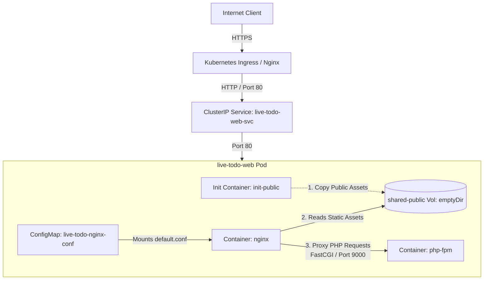

# 📋 Live Todo Web Application — Kubernetes Deployment

[](https://kubernetes.io/)
[](https://helm.sh/)
[](https://nginx.org/)
[](https://www.php.net/)

A high-performance, production-ready Kubernetes deployment configuration and Helm chart for the **Live Todo** web application. This repository showcases a modern DevOps architecture running a containerized Laravel/PHP application using a sidecar pattern with an Nginx reverse proxy.

---

## 🏛️ Architecture Overview

Deploying PHP applications (especially Laravel) in a production Kubernetes cluster requires a robust setup. Instead of running a single bloated container or separating Nginx and PHP-FPM into different pods (which increases network overhead), this project implements the **Nginx-PHP Sidecar Pattern** within a single Pod.



### Key Architectural Concepts:
1. **Multi-Container Pod (Shared Network & Localhost Communication)**:
   - The Pod runs two main containers: **`php-fpm`** (processing PHP logic on port `9000`) and **`nginx`** (serving web traffic on port `80`).
   - Because they reside in the same Pod, they share the network namespace (`localhost` / `127.0.0.1`), allowing Nginx to forward PHP requests to PHP-FPM with near-zero latency.
2. **Init Container Pattern for Static Assets (`init-public`)**:
   - Nginx needs access to Laravel's static public files (CSS, JS, images) to serve them directly.
   - An ephemeral `init-public` container starts first, running the Laravel application image. It copies the public directory (`/var/www/public/.`) into a shared `emptyDir` volume mounted at `/shared-public`.
   - Once completed, the main containers start. The `nginx` container mounts the shared volume at `/var/www/public`, ensuring it always has the exact frontend assets compiled into that specific build tag without needing to duplicate assets into a separate Nginx docker image.
3. **Dynamic Configuration via ConfigMap**:
   - The Nginx virtual host server block is managed outside the Nginx container image using a Kubernetes `ConfigMap`. This makes configuration updates easy without needing to rebuild the container.
4. **SSL/TLS & Ingress Management**:
   - Managed automatically via **Cert-Manager** with Let's Encrypt (`letsencrypt-prod` cluster issuer) ensuring secure HTTPS communication.

---

## 📂 Repository Structure

The repository is organized into two primary deployment methods:

```text
.
├── live-todo/                 # ⛵ Production-ready Helm Chart
│   ├── Chart.yaml             # Chart metadata and versioning
│   ├── values.yaml            # Configurable parameters for Helm deployment
│   ├── .helmignore            # Files ignored when packaging the Chart
│   └── templates/             # Helm Template definitions
│       ├── _helpers.tpl       # Helper templates for label & name generation
│       ├── configmap.yaml     # ConfigMap containing Nginx virtual host configuration
│       ├── deployment.yaml    # Pod definition (PHP-FPM, Nginx, Init Container, Volumes)
│       ├── ingress.yaml       # Ingress rules with Cert-Manager TLS annotations
│       ├── service.yaml       # ClusterIP Service exposing the Nginx container
│       └── tests/
│           └── test-connection.yaml  # Helm post-deployment test connection pod
│
└── live-todo-web/             # 🛠️ Standalone / Reference Manifests (Non-Helm)
    ├── deployment.yaml        # Basic single pod/deployment template
    ├── service.yaml           # Service manifest exposing port 80
    ├── ingress.yaml           # Basic Ingress manifest mapping to local host
    └── values.yaml            # Parameter configuration file for standard templates
```

---

## ⚙️ Configuration Reference (`values.yaml`)

The Helm Chart is fully parameterized. Below are the key configuration options available in [`live-todo/values.yaml`](./live-todo/values.yaml):

| Parameter | Type | Default | Description |
| :--- | :--- | :--- | :--- |
| `namespace` | String | `live-todo-web` | Target Kubernetes Namespace for resources. |
| `replicaCount` | Integer | `2` | Number of running replicas of the application. |
| `image.repository` | String | `azmattullah/live-todo` | Docker repository for the Laravel/PHP-FPM application. |
| `image.tag` | String | `"17"` | Docker tag/version of the application image. |
| `service.type` | String | `ClusterIP` | Kubernetes Service Type (typically `ClusterIP` behind an Ingress). |
| `service.port` | Integer | `80` | External port exposed by the service. |
| `ingress.enabled` | Boolean | `true` | Enable/Disable ingress creation. |
| `ingress.className` | String | `nginx` | Target Ingress Controller class. |
| `ingress.host` | String | `todo.avaditech.com` | Domain name routing to the application. |
| `ingress.annotations` | Map | *See details below* | Annotations for Ingress (e.g., Cert-Manager configs). |
| `ingress.tls.enabled` | Boolean | `true` | Enable automated HTTPS/TLS configuration. |
| `ingress.tls.secretName` | String | `live-todo-tls-secret` | Kubernetes Secret name where Cert-Manager stores the SSL cert. |

### Default Ingress Annotations:
```yaml
ingress:
  annotations:
    cert-manager.io/cluster-issuer: "letsencrypt-prod" 
    nginx.ingress.kubernetes.io/ssl-redirect: "false"
```

---

## 🚀 Deployment Guide

### 📋 Prerequisites
Before deploying, make sure you have:
* A running Kubernetes Cluster (Local like Minikube/Kind, or Cloud like GKE, EKS, AKS).
* `kubectl` configured to communicate with your cluster.
* `helm` (version v3+) installed.
* An Nginx Ingress Controller running in the cluster.
* Cert-Manager installed (if using automated SSL/TLS termination).

---

### Option A: Production Deployment using Helm (Recommended)

#### 1. Preview Manifests (Dry-Run / Debug)
To render the template files and inspect the compiled manifests without actually installing them, run:
```bash
helm template live-todo ./live-todo --debug
```

#### 2. Install the Chart
Deploy the chart to your cluster (this will create/use the namespace defined in `values.yaml` or you can enforce it via cli):
```bash
helm install live-todo ./live-todo -n live-todo-web --create-namespace
```

#### 3. Monitor Deployment Status
Verify that all pods, services, and ingresses are running:
```bash
kubectl get all -n live-todo-web
kubectl get ingress -n live-todo-web
```

#### 4. Upgrade the Application
Whenever you have updates (e.g., new application image tag in `values.yaml`), apply them seamlessly:
```bash
helm upgrade live-todo ./live-todo -n live-todo-web
```

#### 5. Rollback or Uninstall
If anything goes wrong, you can safely uninstall all resources:
```bash
helm uninstall live-todo -n live-todo-web
```

---

### Option B: Raw Reference Manifests

The `live-todo-web/` directory contains standard template files. While Helm is the preferred method for cluster-wide installation, these files serve as a direct template reference. You can apply individual files using:
```bash
# Note: These files contain template interpolation syntax (e.g. {{ .Values... }})
# and must be processed through a templating engine (like Helm) or customized with actual values before executing:
kubectl apply -f live-todo-web/service.yaml -n live-todo-web
```

---

## 🛠️ Verification & Troubleshooting

### 1. Test Ingress Host Routing
If you do not have public DNS configured for your host (e.g., `todo.avaditech.com`), you can test local routing by appending the domain and your Ingress Controller's External IP to your `/etc/hosts` file:
```text
<INGRESS_EXTERNAL_IP> todo.avaditech.com
```

### 2. Run Integrated Connection Test
The Helm Chart includes an automated connection test pod that checks if the service is reachable. Run it via Helm:
```bash
helm test live-todo -n live-todo-web
```

### 3. Check Pod Logs
If the application is not loading, check the logs for individual containers within the Pod:
```bash
# Get logs from the PHP-FPM container
kubectl logs -l app=live-todo-web -c php-fpm -n live-todo-web

# Get logs from the Nginx container
kubectl logs -l app=live-todo-web -c nginx -n live-todo-web
```

### 4. Interactive Debugging
To execute an interactive shell inside the PHP container to run Laravel commands (like `php artisan migrate`):
```bash
kubectl exec -it deployment/live-todo-web-deployment -c php-fpm -n live-todo-web -- bash
```
